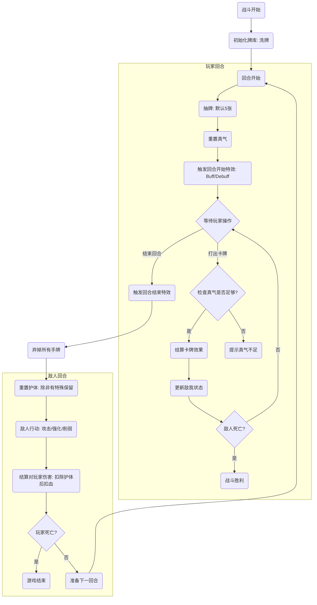

# 武侠卡牌肉鸽游戏 - 战斗规则设计 (Game Rules)

## 1. 核心概念 (Core Concepts)

本游戏采用经典的回合制卡牌战斗模式（类《杀戮尖塔》），融入武侠题材特有的“真气”、“内功”、“招式”等概念。

### 1.1 基础属性
- **生命值 (HP)**: 角色的生存指标。归零则战斗失败。
- **真气 (Qi/Energy)**:以此作为消耗打出卡牌。
    - 默认每回合恢复/重置为固定值（例如 3 点）。
    - 部分“内功”卡牌或遗物可增加真气上限或回复量。
- **护体 (Block/Armor)**: 抵挡来自敌人的伤害。
    - 在敌人回合结束时，未消耗的护体通常会消失（除非有特定“内功”维持）。

### 1.2 卡牌类型 (Card Types)
武侠招式分为三大类：

1.  **招式 (Attack)**
    - 造成直接伤害的攻击手段。
    - 关键词：*连招 (Combo)* - 若本回合已打出过其他牌，触发额外效果。
2.  **身法 (Skill)**
    - 提供护体、抽牌、获得特殊状态等防御或辅助效果。
    - 关键词：*闪避* - 完全规避下一次伤害。
3.  **内功 (Power)**
    - 打出后消失，赋予角色在整场战斗中持续生效的被动能力（Buff）。
    - 例如：“易筋经” - 每回合开始回复生命；“太极心法” - 受到攻击时反弹伤害。

## 2. 战斗流程 (Combat Flow)

战斗遵循标准的回合制循环。

### 2.1 流程图 (Flowchart)

## 3. 状态效果 (Status Effects/Buffs & Debuffs)

### 正面状态 (Buffs)
- **聚气 (Focus)**: 下一次造成的伤害增加 X%。
- **轻功 (Evasion)**: 有 X% 概率完全闪避攻击。
- **护体真气 (Retain Block)**: 回合结束时护体不会消失。
- **反震 (Thorns)**: 受到攻击时，对攻击者造成 X 点伤害。

### 负面状态 (Debuffs)
- **内伤 (Vulnerable)**: 受到伤害增加 50%。
- **破绽 (Weak)**: 造成伤害减少 25%。
- **走火入魔 (Confused)**: 打出的牌费用随机变化，或目标随机。
- **点穴 (Stun)**: 无法行动一回合（BOSS通常免疫或转为消耗层数）。
- **流血 (Bleed)**: 每当你打出一张牌，受到 X 点伤害。

## 4. 意图系统 (Intent System)
玩家可见敌人的下回合意图：
- **攻击意图**: 显示即将造成的伤害数值。
- **防御意图**: 显示即将获得的护甲。
- **绝技意图**: 施包含强力 Debuff 或多段攻击的特殊行动。

## 5. 初始卡组示例 (Starter Deck)
1.  **长拳 (Attack)**: 造成 6 点伤害。 (x4)
2.  **格挡 (Skill)**: 获得 5 点护体。 (x4)
3.  **气沉丹田 (Skill)**: 获得 1 点真气，抽 1 张牌。 (x1)
4.  **突刺 (Attack)**: 造成 9 点伤害，施加 1 层“内伤”。 (x1)
